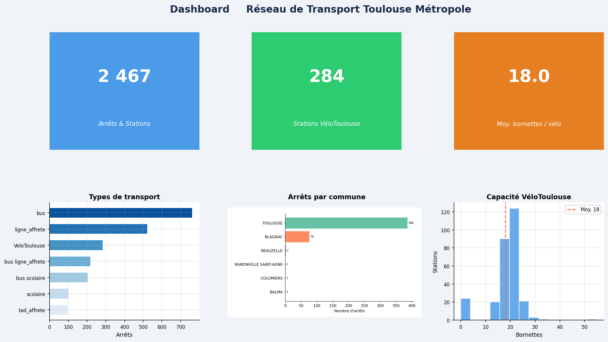
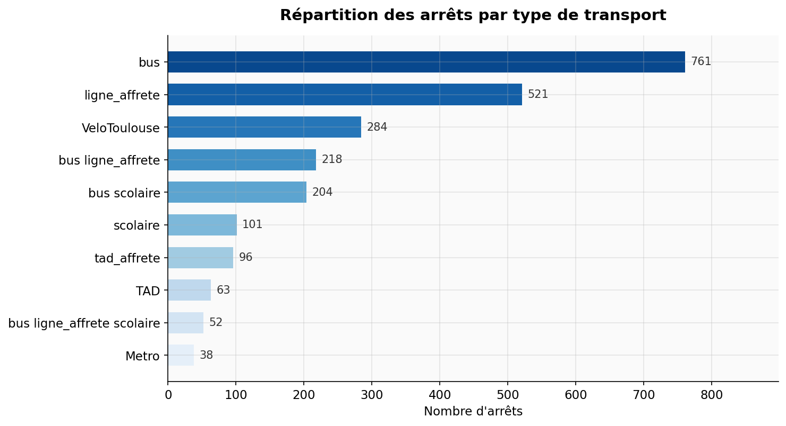
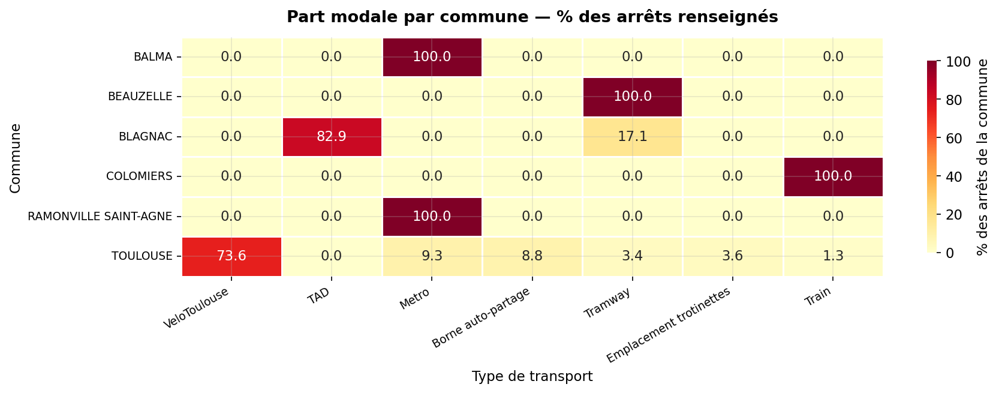
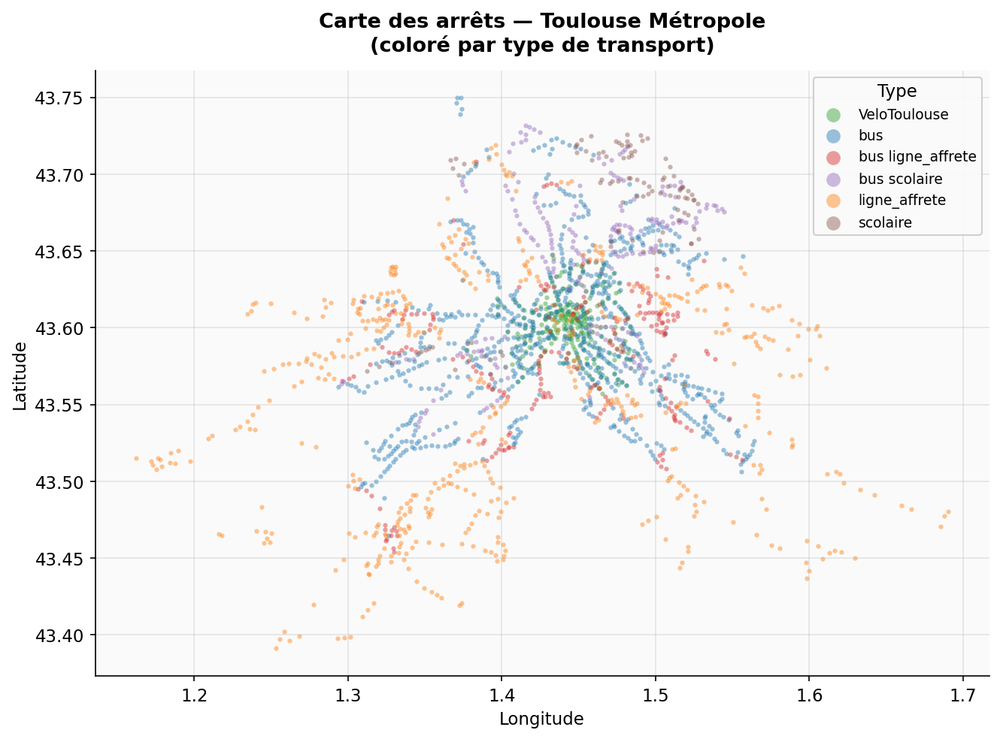
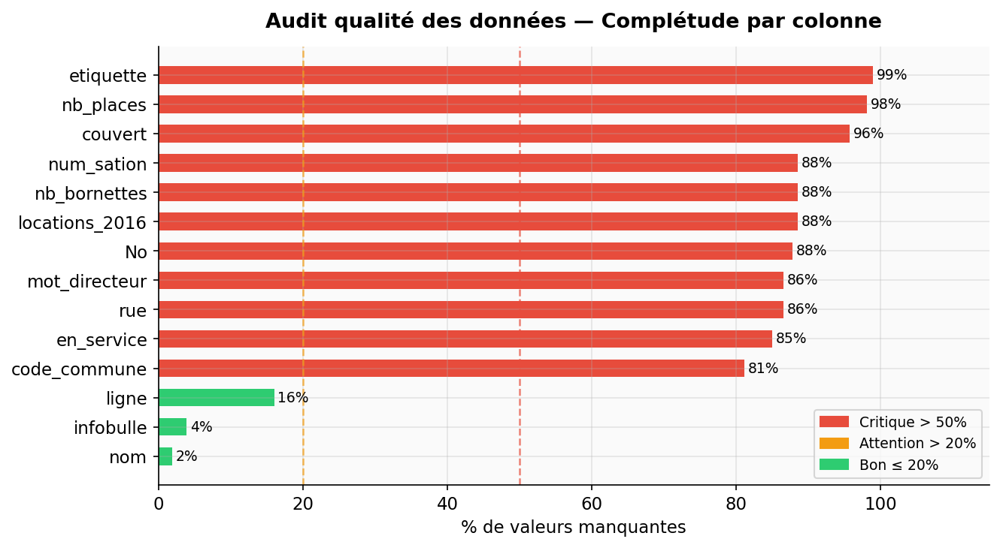

# 🚌 Analyse du Réseau de Transport en Commun de Toulouse

<div align="center">


**Pipeline complet de Data Analytics sur les données de mobilité urbaine de Toulouse Métropole**  
*Nettoyage · Modélisation · Analyse statistique · Dashboard interactif · Cartographie*

</div>

---

## 👤 Auteur

**Nicolas SAIZE** - Étudiant en L2 MIAGE 
🔗 [linkedin.com/in/nicolas-saize](https://www.linkedin.com/in/nicolas-saize/)

---

## 📋 Contexte du projet

Ce projet porte sur les **arrêts et stations du réseau Tisséo** (Toulouse Métropole) : bus, métro, tramway, VéloToulouse, bornes auto-partage et plus encore.

À partir de **3 fichiers CSV bruts** issus de l'Open Data de Toulouse Métropole, j'ai construit un pipeline end-to-end :

```
Données brutes (CSV)
      │
      ▼
Nettoyage & Normalisation   →  normaliser_donnees.py
      │
      ▼
Modélisation relationnelle  →  3 tables, 2 jointures
      │
      ├──▶ Requêtes Python pur     →  interrogation_donnees.py
      ├──▶ Requêtes Pandas         →  interrogation_donnees_pandas.py
      ├──▶ Analyse statistique     →  analyse_exploratoire.ipynb
      ├──▶ Visualisations          →  visualisation_donnees.py
      └──▶ Dashboard interactif    →  dashboard/app.py
```

**Compétences démontrées :**
- Nettoyage et normalisation de données hétérogènes
- Modélisation relationnelle (clés étrangères, jointures)
- Analyse statistique descriptive et exploratoire (EDA)
- Visualisation statique (Matplotlib, Seaborn) et cartographique (Folium)
- Dashboard interactif (Streamlit) et rapport Power BI (`.pbix`)
- Tests unitaires (unittest, 124 tests)

---

## 📊 Aperçu du dashboard

> Interface Streamlit avec filtres interactifs par type de transport et par commune.



---

## 🗂️ Structure du projet

```
toulouse-transport-analysis/
│
├── asset/                             ← Visuels exportés (README & docs)
│   ├── dashboard_preview.png
│   ├── chart_types.png
│   ├── heatmap_commune_type.png
│   ├── data_quality.png
│   └── geo_scatter.png
│
├── data/
│   ├── fichier1.csv                    # Référentiel communes (6 lignes)
│   ├── fichier2.csv                    # Référentiel types de transport (18 lignes)
│   └── fichier3.csv                    # Arrêts & stations — table principale (2 467 lignes)
│
├── src/
│   ├── normaliser_donnees.py           # Nettoyage et génération des 3 tables
│   ├── interrogation_donnees.py        # Opérateurs relationnels en Python pur
│   ├── interrogation_donnees_pandas.py # Mêmes opérateurs avec Pandas
│   └── visualisation_donnees.py        # Visualisations Matplotlib / Seaborn / Folium
│
├── tests/
│   ├── test_interrogation_donnees.py        # 70+ tests unitaires (Python pur)
│   └── test_interrogation_donnees_pandas.py # 50+ tests unitaires (Pandas)
│
├── notebook/
│   └── analyse_exploratoire.ipynb      # EDA complète avec insights métier
│
├── dashboard/
│   ├── app.py                          # Dashboard Streamlit interactif
│   └── toulouse_transport.pbix         # Dashboard Power BI
│
├── requirements.txt
└── README.md
```

---

## 📁 Les données

| Fichier | Contenu | Lignes | Colonnes clés |
|---|---|---|---|
| `fichier1.csv` | Communes de la métropole | 6 | `Code commune`, `commune` |
| `fichier2.csv` | Types de transport | 18 | `Code type`, `type` |
| `fichier3.csv` | Arrêts & stations | 2 467 | `nom`, `ligne`, `geo point`, `nb_bornettes` |

---

## 🔍 Analyse exploratoire — Insights clés

### Répartition par type de transport



> Le **bus** domine avec 31% des arrêts, suivi des lignes affrétées (21%) et de VéloToulouse (12%).  
> Le métro et le tramway, bien que modes structurants, représentent une part faible en nombre d'arrêts — ce qui reflète leur densité de desserte concentrée.

---

### Part modale par commune



> **Lecture :** chaque cellule indique le % des arrêts de la commune relevant d'un type donné.  
> Toulouse concentre tous les modes lourds. Les communes périphériques dépendent quasi-exclusivement du bus et des lignes affrétées.

---

### Carte géographique des arrêts



> Les stations **VéloToulouse** (vert) forment un cluster dense dans le centre de Toulouse, tandis que les **arrêts de bus** (bleu) s'étendent en périphérie le long des axes radiaux.

---

### Audit qualité des données



> ⚠️ Plusieurs colonnes sont très incomplètes : `code_commune` (81% de valeurs manquantes), `en_service`, `couvert`.  
> Ce constat est intégré dans l'analyse : toute conclusion sur ces champs est présentée avec les réserves appropriées.

---

## 🚀 Lancer le projet

### Prérequis

```bash
git clone https://github.com/nicolassaize/toulouse-transport-analysis.git
cd toulouse-transport-analysis
python -m venv venv && source venv/bin/activate   # Windows : venv\Scripts\activate
pip install -r requirements.txt
```

### Dashboard interactif

```bash
streamlit run dashboard/app.py
```

Le dashboard s'ouvre sur `http://localhost:8501`

### Notebook d'analyse

```bash
jupyter notebook notebook/analyse_exploratoire.ipynb
```

### Tests unitaires

```bash
python -m unittest tests/test_interrogation_donnees tests/test_interrogation_donnees_pandas -v
# → 124 tests, 0 erreur
```

---

## 📊 Dashboard Power BI

Un dashboard Power BI a été réalisé en parallèle du dashboard Streamlit, couvrant les mêmes analyses (répartition par type, carte géographique, capacité VéloToulouse) avec les fonctionnalités natives de Power BI : segments interactifs, mesures DAX, et carte azimutale.

> 📁 Fichier disponible dans `dashboard/toulouse_transport.pbix`

---

## 🛠️ Stack technique

| Catégorie | Outil | Usage |
|---|---|---|
| Langage | Python 3.10+ | Pipeline complet |
| Manipulation | Pandas 2.x, NumPy | Nettoyage, jointures, stats |
| Visualisation | Matplotlib, Seaborn | Graphiques statiques |
| Cartographie | Folium | Cartes interactives HTML |
| Dashboard | Streamlit | Interface interactive |
| Notebook | Jupyter | EDA documentée |
| BI | Power BI | Dashboard `.pbix` |
| Tests | unittest | 124 tests unitaires |

---

## 📬 Contact

**Nicolas SAIZE**  
🔗 [linkedin.com/in/nicolas-saize](https://www.linkedin.com/in/nicolas-saize/)

---

<div align="center">
<sub>Données sources : Open Data Toulouse Métropole — Projet réalisé dans le cadre d'un projet Data personnel </sub>
</div>
